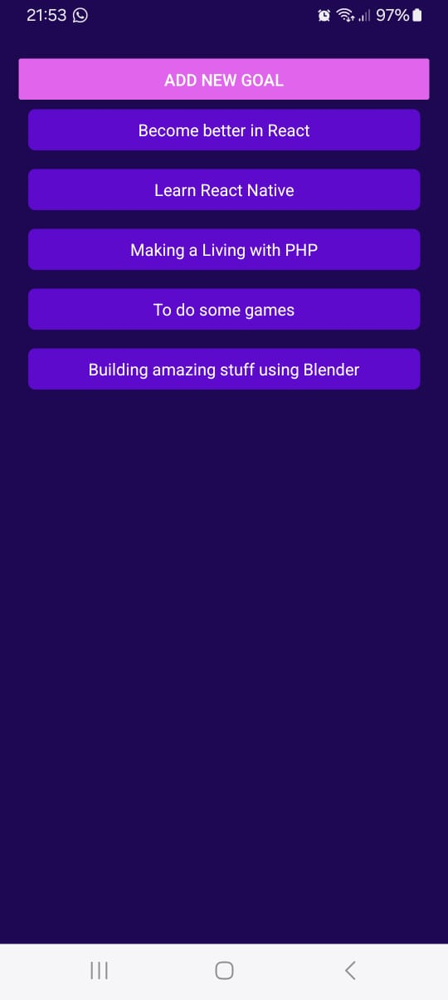

<h1 align="center">My Goals App</h1>

  

Este é um projeto de estudos em React Native, uma aplicação de cadastro de metas pessoais (goals) no estilo "todo list". A aplicação permite adicionar e remover tarefas em dispositivos móveis Android e iOS, utilizando estilos personalizados e um modal para melhorar a experiência do usuário (UX). Até o momento, por se tratar de um projeto de estudos, em React Native, não existe armazenamento de dados. 

## ✨ Funcionalidades

- ➕ Adicionar goals
- ❌ Remover goals
- 🖼️ Modal personalizado para interação do usuário
- 🎨 Estilização customizada

## 🛠️ Tecnologias Utilizadas

- ⚛️ React Native
- 🌐 Expo
- 📱 Componentes nativos de Android e iOS

## 📋 Pré-requisitos

- 🌐 Node.js
- 🚀 Expo CLI
- 📱 Emulador Android/iOS ou dispositivo físico

## ⚙️ Instalação

- Clone o repositório:
- cd projeto_clonado
- npm install
- npm run dev

  

